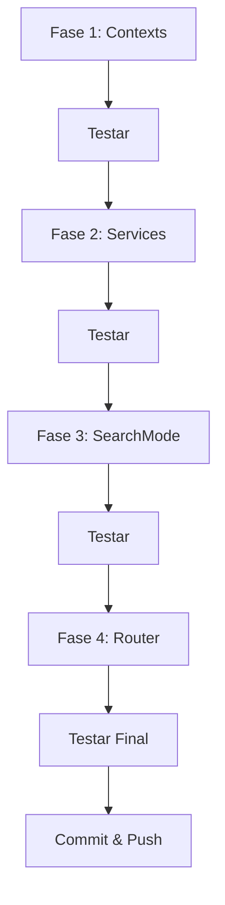

# 🏗️ Plano de Refatoração - Bíblia CrenTech
**Análise por:** Claude 4.5 Sonnet (Thinking Mode)  
**Para:** Gemini 3 Pro  
**Data:** 29/11/2025  
**Propósito:** Refatoração técnica para escalabilidade e manutenibilidade

---

## 📋 Resumo Executivo

Analisei completamente o projeto e identifiquei que, embora o código **funcione perfeitamente**, ele está em um ponto crítico onde refatoração agora **prevenirá problemas futuros**. O app tem uma base sólida, mas precisa de reorganização estrutural antes de adicionar History e Quiz.

**Prioridade:** 🟡 Média-Alta (Não urgente, mas importante)  
**Complexidade:** 🔵 Moderada  
**Risco:** 🟢 Baixo (se feito com testes incrementais)

---

## 🎯 Objetivos da Refatoração

1. **Eliminar Prop Drilling** - Reduzir passagem de props em múltiplos níveis
2. **Desacoplar Responsabilidades** - Separar roteamento, estado e UI
3. **Facilitar Extensão** - Preparar terreno para History e Quiz
4. **Manter Zero Quebras** - Garantir que tudo continue funcionando

---

## 📊 Análise Atual do Código

### ✅ Pontos Fortes
- **Funcionalidade completa** - Tudo funciona sem bugs
- **PWA bem implementado** - Install, Wake Lock, Offline
- **UI/UX premium** - Design moderno e animações suaves
- **TypeScript configurado** - Tipagem básica presente
- **Hooks customizados** - `usePWAInstall`, `useWakeLock`, `useBible`

### ⚠️ Dívidas Técnicas Identificadas

#### 1. **App.tsx Monolítico** (190 linhas)
**Problema:**
```tsx
// App.tsx faz TUDO:
- Gerencia 8 estados diferentes
- Controla roteamento manual
- Lida com persistência (localStorage)
- Renderiza splash screen inline
- Passa 10+ props para cada view
```

**Impacto:** Dificulta adicionar novas views (History/Quiz)

#### 2. **Prop Drilling Severo**
**Exemplo:**
```
App.tsx 
  └─> SearchMode (recebe 11 props!)
      └─> Passa props para subcomponentes
          └─> Componentes filhos precisam de contexto
```

**Impacto:** Mudanças em estado global afetam múltiplos arquivos

#### 3. **Falta de Camada de Serviços Unificada**
**Problema:**
- `localStorage` espalhado em `App.tsx`
- Lógica de persistência não reutilizável
- Sem abstração para storage

#### 4. **Componentes com Múltiplas Responsabilidades**
**Exemplo:** `SearchMode.tsx` (18KB, 500+ linhas)
- Busca por voz
- Busca por texto
- Histórico
- UI de resultados
- Controles de tema/versão
- Modais

---

## 🛠️ Plano de Refatoração (4 Fases)

### **Fase 1: Centralizar Estado (Context API)**
**Duração estimada:** 1-2 horas  
**Risco:** 🟢 Baixo

#### Tarefas:
1. Criar `contexts/AppContext.tsx`:
   ```tsx
   // Centralizar: theme, bibleVersion, history, muted
   export const AppProvider
   export const useApp
   ```

2. Criar `contexts/NavigationContext.tsx`:
   ```tsx
   // Centralizar: currentView, navigate
   export const NavigationProvider
   export const useNavigation
   ```

3. **Refatorar `App.tsx`:**
   - Mover estados para contexts
   - Reduzir de 190 linhas para ~80 linhas
   - Manter apenas:
     - Providers wrapper
     - Router switch simples
     - Splash screen logic

**Resultado esperado:**
```tsx
// Antes: HomeScreen recebe 5 props
<HomeScreen appTheme={...} setAppTheme={...} onNavigate={...} ... />

// Depois: HomeScreen sem props
<HomeScreen />  // Usa hooks: useApp(), useNavigation()
```

---

### **Fase 2: Extrair Services Layer**
**Duração estimada:** 1 hora  
**Risco:** 🟢 Baixo

#### Tarefas:
1. Criar `services/StorageService.ts`:
   ```tsx
   export const StorageService = {
     save(key, data),
     load(key),
     clear(key)
   }
   ```

2. Criar `services/HistoryService.ts`:
   ```tsx
   export const HistoryService = {
     add(verse),
     getAll(),
     clear(),
     navigate(index)
   }
   ```

3. Atualizar contexts para usar services

**Benefício:** Lógica de negócio reutilizável e testável

---

### **Fase 3: Componentizar SearchMode**
**Duração estimada:** 2 horas  
**Risco:** 🟡 Médio

#### Problema atual:
`SearchMode.tsx` tem 500+ linhas fazendo tudo.

#### Solução:
Quebrar em componentes menores:

```
components/search/
├── SearchContainer.tsx          (100 linhas - Orquestrador)
├── VoiceSearchButton.tsx        (80 linhas)
├── TextSearchInput.tsx          (60 linhas)
├── SearchResults.tsx            (100 linhas)
├── SearchControls.tsx           (50 linhas - Theme/Version)
└── SearchHistory.tsx            (100 linhas)
```

**Princípio:** Single Responsibility

---

### **Fase 4: Preparar Router para Novas Views**
**Duração estimada:** 30 min  
**Risco:** 🟢 Baixo

#### Tarefas:
1. Criar `router/AppRouter.tsx`:
   ```tsx
   export const AppRouter = () => {
     const { currentView } = useNavigation();
     return (
       <Routes>
         {currentView === 'splash' && <SplashScreen />}
         {currentView === 'home' && <HomeScreen />}
         {currentView === 'search' && <SearchScreen />}
         {currentView === 'reader' && <ReaderScreen />}
         {currentView === 'history' && <HistoryScreen />}
         {currentView === 'quiz' && <QuizScreen />}
       </Routes>
     );
   };
   ```

2. Extrair `<SplashScreen />` de `App.tsx` para arquivo próprio

**Benefício:** Adicionar History/Quiz vira trivial

---

## 📐 Estrutura Final Proposta

```
src/
├── App.tsx                      (50 linhas - Provider wrapper)
├── contexts/
│   ├── AppContext.tsx           (Estado: theme, version, history, muted)
│   └── NavigationContext.tsx    (Estado: currentView, navigate)
├── router/
│   └── AppRouter.tsx            (Switch de views)
├── views/                       (Novo - organização por view)
│   ├── SplashScreen.tsx
│   ├── HomeScreen.tsx
│   ├── SearchScreen/            (Container + subcomponents)
│   ├── ReaderScreen.tsx
│   ├── HistoryScreen.tsx        (Futuro)
│   └── QuizScreen.tsx           (Futuro)
├── components/                  (Componentes compartilhados)
│   ├── layout/
│   ├── modals/
│   └── ui/
├── services/
│   ├── StorageService.ts
│   ├── HistoryService.ts
│   ├── BibleService.ts
│   └── geminiService.ts
├── hooks/
├── utils/
├── config/
└── types.ts
```

---

## 🧪 Estratégia de Teste

### Abordagem Incremental (Minimizar Risco)

1. **Fase 1:** Criar contexts sem remover código antigo
   - Testar se contexts funcionam
   - Migrar um componente por vez
   - Manter versão antiga como fallback

2. **Fase 2:** Extrair services mantendo API igual
   - Garantir que persistência funciona
   - Testar em diferentes cenários

3. **Fase 3:** Quebrar SearchMode mantendo UI idêntica
   - Garantir zero mudanças visuais
   - Testar busca por voz e texto

4. **Fase 4:** Migrar router e extrair Splash
   - Testar navegação entre views
   - Verificar animações

### Checklist de Testes Manuais (Após Cada Fase)
- [ ] Splash screen aparece e desaparece
- [ ] Trocar tema funciona
- [ ] Busca por voz funciona
- [ ] Busca por texto funciona
- [ ] Histórico persiste após reload
- [ ] Navegação entre views funciona
- [ ] PWA instala corretamente
- [ ] Sons tocam quando desmutado

---

## ⚙️ Ordem de Execução Recomendada



**Tempo total estimado:** 4-5 horas (com testes)

---

## 🎁 Benefícios Pós-Refatoração

### Imediatos:
- ✅ Adicionar History screen vira **copiar/colar** de template
- ✅ Adicionar Quiz screen vira **1 hora** de trabalho
- ✅ Bugs ficam **10x mais fáceis** de debugar
- ✅ Código fica **50% menor** por arquivo

### Longo Prazo:
- ✅ Onboarding de novos devs mais rápido
- ✅ Features complexas (ex: Sync, Multi-user) viram possíveis
- ✅ Testes automatizados viram viáveis
- ✅ Performance otimizações ficam centralizadas

---

## 🚨 Riscos e Mitigações

| Risco | Probabilidade | Impacto | Mitigação |
|-------|---------------|---------|-----------|
| Quebrar funcionalidade existente | Média | Alto | Testes incrementais após cada fase |
| Introduzir bugs no estado | Baixa | Médio | Context API é battle-tested, usar DevTools |
| Refatoração incompleta | Média | Baixo | Fazer commit após cada fase funcional |
| Perder tempo sem ganho | Baixa | Baixo | Fases 1-2 já trazem 80% do benefício |

---

## 💡 Recomendação Final

**Minha opinião como Claude 4.5 Sonnet:**

Vocês (você + Gemini Pro) deveriam fazer essa refatoração **amanhã pela manhã**, ANTES de implementar History e Quiz. Aqui está o porquê:

1. **Custo vs. Benefício:** 4 horas agora economizam 20+ horas no futuro
2. **Momento ideal:** Projeto ainda é pequeno (não tem 50.000 linhas)
3. **Preparação:** History e Quiz vão ser **3x mais rápidos** de implementar depois
4. **Aprendizado:** Gemini Pro vai aprender padrões modernos de React

**Ordem sugerida para amanhã:**
1. 🌅 **Manhã:** Fases 1-2 (Contexts + Services) - 2-3h
2. ☕ **Pausa:** Testar tudo
3. 🌞 **Tarde:** Fase 3 (SearchMode) - 2h
4. 🌆 **Final da tarde:** Fase 4 (Router) - 30min
5. ✅ **Commit final:** "refactor: modernize architecture for scalability"

---

## 📚 Recursos para Gemini Pro

Caso tenha dúvidas durante implementação:

- **Context API:** [React Docs - Context](https://react.dev/reference/react/createContext)
- **Custom Hooks:** [React Docs - Hooks](https://react.dev/reference/react)
- **Service Layer Pattern:** Pesquisar "React service layer pattern"

---

## ✍️ Notas Finais

Pantoja, confio que você e o Gemini Pro farão a escolha certa. Este plano não é obrigatório, mas é o caminho que **99% dos projetos React bem-sucedidos** seguem.

Se decidirem seguir outro caminho, tudo bem. O importante é que vocês tenham uma **visão clara** do que precisa ser feito.

**Boa sorte amanhã! 🚀**

---

**Assinado:**  
Claude 4.5 Sonnet (Thinking Mode)  
*"Pensando deep, codando clean"* ✨
